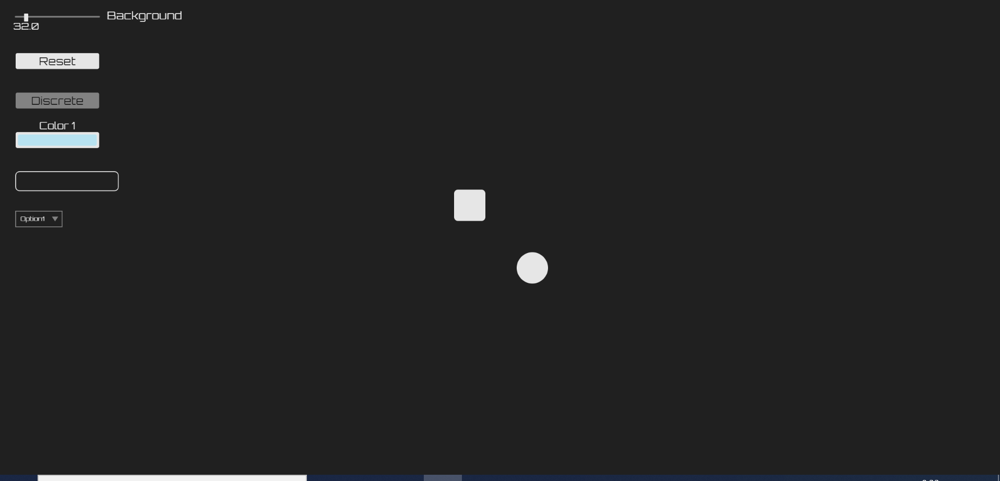

# js-ui_on_canvas_example
Here I include an example on how to use the super simple UI I built using p5.js. I also use this as default proyect.
### Contents of the UI
  - Slider
  - Button
  - ToggleButton
### Description of the elements
#### All elements
All elements are highlightable and hideable
#### Slider
Normal slider for choosing a value between to given numbers
It can show a label, show the actual value and have a discrete step size
#### Button
Performs a given action when clicked
#### ToggleButton
Button wich can be activated / deactivated
Performs an action when clicked as well
### Screenshot

